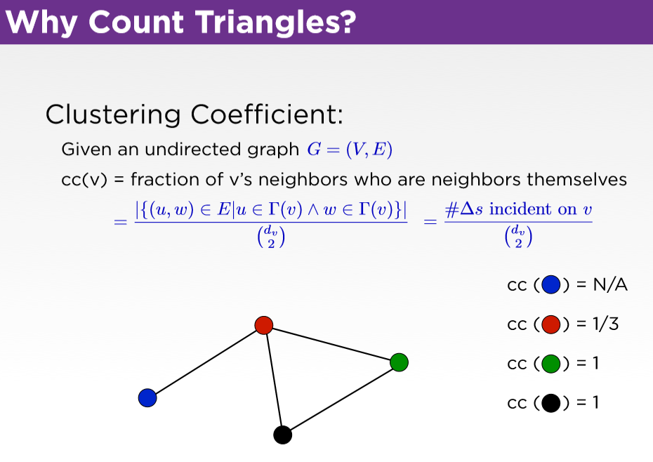
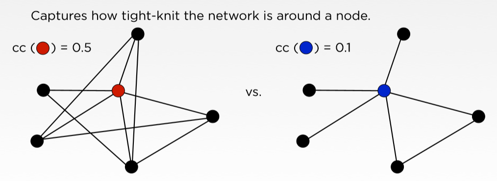
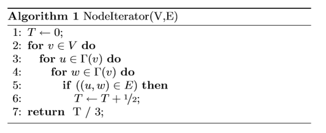
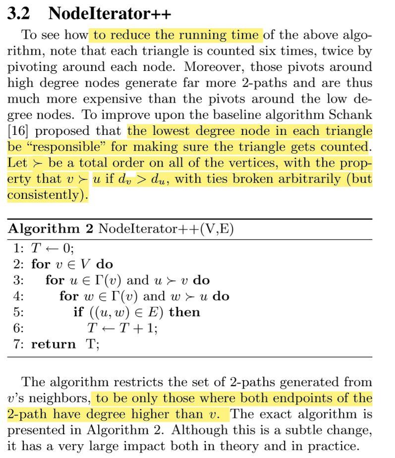
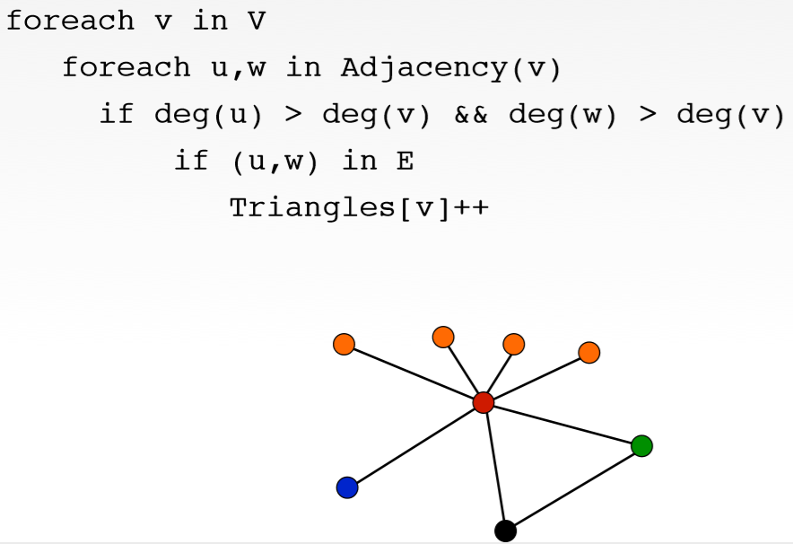
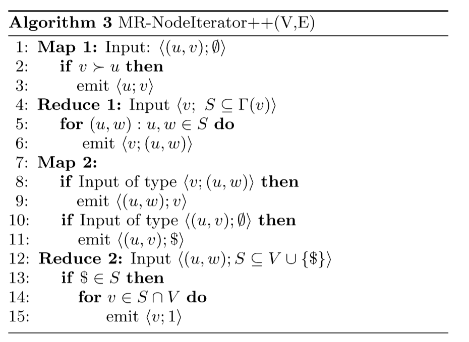

# Clustering-Coefficient-Hadoop-MapReduce
Use MapReduce technique in Hadoop Java to count triangles in an undirected graph to calculate the clustering coefficient.

## How to run?

### Dependency
1. Hadoop 3.2.1.
2. Ubuntu 16.04 LTS in windows 10.
3. Openjdk version 1.8.0_252 in Ubuntu.

Terminal in Ubuntu:
```
$ /bin/hadoop jar TriangleCounterNaive.jar NaiveTriangleCounter [Argument]
```
where [Argument] is a required argument:
- 1: a tiny test graph (/dataset/test/test.txt).
- 2: a small graph (/dataset/small-graph/smallgraph.txt).
- 3: a big graph (/dataset/big-graph/graph.txt).

## Clustering Coefficient and Triangle Counting
Paper is here.
https://theory.stanford.edu/~sergei/papers/www11-triangles.pdf

The clustering coefficient measures the degree to which a node’s neighbors are themselves neighbors. In sociology, it describes how tight the community of someone is.



The numerator in the above quotient is the number of edges between neighbors of v. 

The denominator is the number of possible edges between neighbors of v. 

There is also an equivalent way to view the clustering coefficient. 

{u,v,w} must form a triangle.



## Raw data
A collection of edges (u, v) of an undirected graph,
which means if there is an edge between i and j, there should be an edge between j and i. Every line represents an edge between two vertices. 

## Naive Algorithm
### Single process version


### MapReduce version (parallel)
- Input: raw data.
- Output: the number of triangles incident to every single vertex.

```
Mapper0(key null, value rawdata):
    for each edge in rawdata:
        emit(<u,v>)

Reducer1(key u, values [v1, v2, ... , vk]):
    // key: u
    // values: neighbors of u
    for each value in values:
        // actual edge
        emit(<(u,value), "$">)  
    
    int size = values.size()
    for i in range(0, size):
        for j in range(i+1, size):
            // possible edge (values[i], values[j]) which may form an triangle with vertex u
            emit(<(values[i], values[j]), u>)   

Mapper2(key null, values: output of Reducer1):
    
    emit(<(u,value), "$">) or emit(<(values[i], values[j]), u>) 

Reducer2(key edge, values [v1, v2, ... , vk] or [v1, v2, ... , vk, $]):
    // [v1, v2, ... , vk, $] contains "$", meaning that there are k triangles. 
    // They are incident to v1, v2, ... , vk, respectively.
    if values contains "$":
        for each value in values:
            emit(<value, 1>)

// The rest of the job is just like word count.
```


## An improved Algorithm
- Drawback in naive algorithm: in Reducer1, we use a nested for loop to generate all neighbors of every vertex, which is a $O(N^2)$ time.

- Idea: we count the total number of triangles, instead of the incident triangles for every single vertex. We can do that by taking the vertex with lowest degree in every single triangle for making sure that triangle get counted.

By doing that, we avoid perform $O(N^2)$ time on the high degree vertex, which will break the curse of the last reducer.




**In this example, we are able to avoid perform a nested loop on the neighbors of the red vertex.**





### Raw data
Every line represents an edge between two vertices.

```
/*  
 *  Data Proprocess: 
 *  We could use two mapReduce rounds to generate the degree of every vertex and add them to the raw data. 
 *  In this process, we also eliminate the duplicate edges. 
 *  For example, edge(v1,v2) and edge(v2,v1) are duplicate and we only retain edge(v1,v2) where the vertex with smaller id will put in the first place of the tuple.
 *  The output of Reducer2 will be lines of ("v1,d1" "v2,d2").
 */

// Now the algorithm 3 will begin
Mapper3(key null, values: output of Reducer2):
    for each edge(u,v):
        if du < dv:
            emit(<u,v>)
        else:
            emit(<v,u>)

Reducer3(key vertex u, values: [v1, v2, ... , vk])
    // values: list of neighbors of vertex w
    int size = values.size()
    for i in range(0, size):
        for j in range(i+1, size):
            // possible edge (values[i], values[j]) which may form an triangle with vertex u
            emit(<u, (values[i], values[j])>)   

Mapper4:
    Input type 1: output of Reducer3
        emit(<(u,w),v>)     // possible triangle

    Input type 2: the original edge list
        emit(<(u,v),"$">)            // actual edge

Reducer4(key edge, values [v1, v2, ... , vk] or [v1, v2, ... , vk, $]):
    if values contains "$":
        for each value in values:
            emit(<value, 1>)

// The rest of the job is just like word count.
```

## Partition Algorithm

In this section we present a different algorithm for counting triangles. The algorithm works by partitioning the graphs into overlapping subsets so that each triangle is present in at least one of the subsets. Given such a partition, we can then use any sequential triangle counting algorithm as a black box on each partition, and then simply combine the results. 
